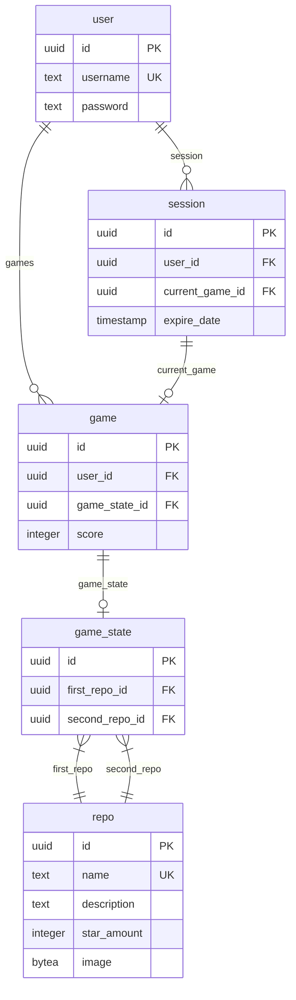

# Database diagram

### Notes:

- All columns are NOT NULL, unless specified otherwise

```mermaid
erDiagram
    user {
        uuid id PK
        text username UK
        text password
    }

    session {
        uuid id PK
        uuid user_id FK
        uuid current_game_id FK
        timestamp expire_date
    }

    repo {
        uuid id PK
        text name UK
        text description
        integer star_amount
        bytea image
    }

    game {
        uuid id PK
        uuid user_id FK
        uuid game_state_id FK
        integer score
    }

    game_state {
        uuid id PK
        uuid first_repo_id FK
        uuid second_repo_id FK
    }

    user 1--0+ game: "games"
    user 1--0+ session: "session"
    session 1--zero or one game: "current_game"
    game 1--zero or one game_state: "game_state"
    game_state 1+--1 repo: "first_repo"
    game_state 1+--1 repo: "second_repo"
```