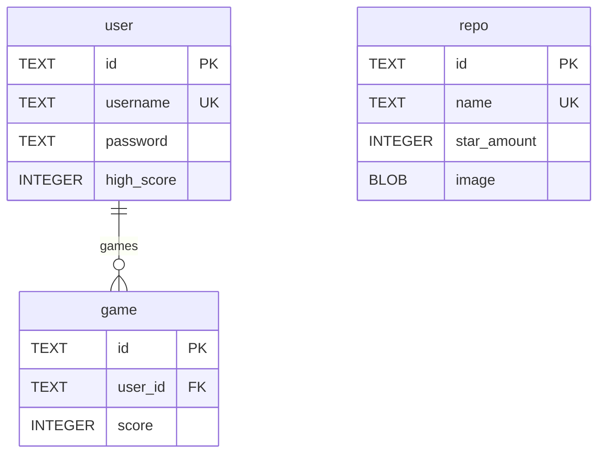

# Database diagram

### Notes:

- All primary keys are UUIDs
- All columns are NOT NULL, unless specified otherwise

```mermaid
erDiagram
    user {
        TEXT id PK
        TEXT username UK
        TEXT password
        INTEGER high_score
    }

    repo {
        TEXT id PK
        TEXT name UK
        INTEGER star_amount
        BLOB image
    }

    game {
        TEXT id PK
        TEXT user_id FK
        INTEGER score
    }

    user 1--0+ game: "games"
```